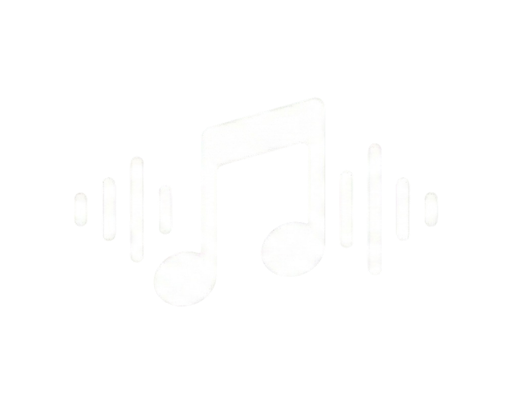
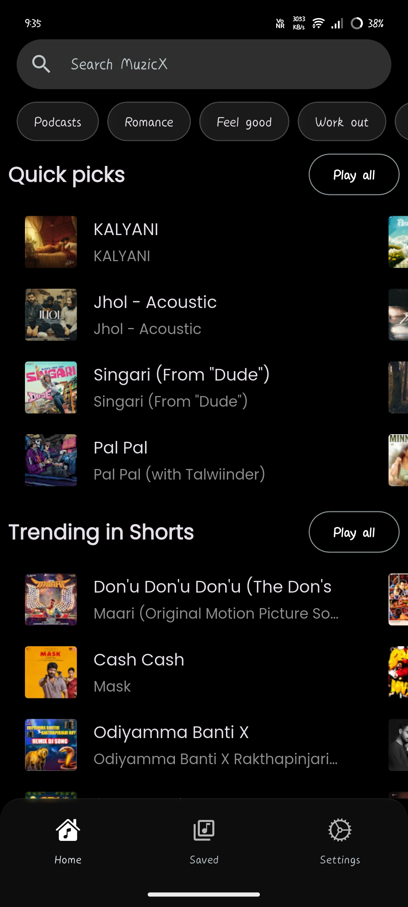

<div align="center">
  
  
  # MuzicX App
  
  
  ### Your Ultimate Music Streaming & Download Companion
  
  [](https://flutter.dev)
  [](https://firebase.google.com)
  [](LICENSE)
  [](https://github.com/MrTG-CodeBot/muzicX-music-app)
  
  **Stream • Download • Enjoy**
  
  [Download Now](#installation) • [Features](#features) • [Screenshots](#screenshots) • [Support](#support)
  
</div>

---

## 📱 App Preview

<div align="center">
  
  <p><i>Beautiful, intuitive interface designed for music lovers</i></p>
</div>

---

## ✨ Features

### 🎼 Music Streaming & Discovery
- **YouTube Music Integration** - Access millions of songs from YouTube Music
- **Smart Search** - Find your favorite songs, albums, artists instantly
- **Personalized Home** - Dynamic recommendations and trending music
- **Browse by Genre** - Explore music across multiple categories
- **Artist & Album Pages** - Deep dive into your favorite artists' discographies

### 💾 Downloads & Offline Playback
- **High-Quality Downloads** - Download songs in multiple formats (M4A, MP3, AAC, FLAC)
- **Active Download Manager** - Track and manage multiple downloads simultaneously
- **Playlist Downloads** - Download entire playlists with one tap
- **Resume & Pause** - Full control over download operations
- **Offline Mode** - Enjoy your music without internet connection
- **Smart Storage Management** - View and manage downloaded files efficiently

### 📚 Library Management
- **Favorites System** - Save your loved tracks with cloud sync
- **Custom Playlists** - Create and organize unlimited playlists
- **YouTube Music Import** - Import your YT Music playlists seamlessly
- **Spotify Import** - Bring your Spotify playlists to MuzicX
- **Listen History** - Track your listening habits across devices
- **Smart Organization** - Auto-categorized library with search

### 🎵 Advanced Audio Player
- **High-Fidelity Playback** - Crystal clear audio quality
- **Queue Management** - Reorder, shuffle, and organize your queue
- **Lyrics Support** - Synchronized lyrics display
- **Sleep Timer** - Auto-stop playback after set duration
- **Audio Equalizer** - Customize your sound experience
- **Background Playback** - Continue listening while using other apps
- **Mini Player** - Persistent playback controls across app

### 🌐 Cloud & Sync Features
- **Firebase Integration** - Secure cloud storage for your data
- **Cross-Device Sync** - Access your library from any device
- **Google Sign-In** - Quick and secure authentication
- **Email Authentication** - Alternative sign-in option
- **Real-time Updates** - Instant sync across all your devices
- **Settings Backup** - Your preferences saved in the cloud

### 🎨 Customization & Preferences
- **Dynamic Theming** - Automatic color adaptation based on album art
- **Dark/Light Mode** - Choose your preferred theme
- **Multiple Languages** - Localized interface support
- **Custom Settings** - Personalize your experience
- **Appearance Controls** - Fine-tune the visual experience

### 🔔 Smart Features
- **Download Notifications** - Real-time progress updates
- **Force Update System** - Stay up-to-date with latest features
- **Share Songs** - Share your favorite tracks with friends
- **Intent Sharing** - Open shared music links directly in MuzicX
- **Offline Detection** - Smart handling of network changes

### 🖥️ Platform Support
- ✅ **Android** - Optimized for Android devices
- ✅ **iOS** - Full iOS support with native feel
- ✅ **Windows** - Desktop experience for Windows users
- ✅ **Linux** - Native Linux support
- ✅ **macOS** - Seamless macOS integration

---

## 🚀 Getting Started

### Prerequisites
- Flutter SDK (3.4.1 or higher)
- Dart SDK
- Android Studio / Xcode (for mobile development)
- Firebase Account (for cloud features)

### Installation

1. **Clone the repository**
   ```bash
   git clone https://github.com/yourusername/muzicx.git
   cd muzicx
   ```

2. **Install dependencies**
   ```bash
   flutter pub get
   ```

3. **Setup Firebase**
   ```bash
   # Run the Firebase setup script
   setup_firebase.bat
   ```

4. **Run the app**
   ```bash
   flutter run
   ```

---

## 🏗️ Built With

### Core Technologies
- **[Flutter](https://flutter.dev)** - UI framework
- **[Dart](https://dart.dev)** - Programming language
- **[Firebase](https://firebase.google.com)** - Backend & Authentication
- **[Hive](https://hivedb.dev)** - Local database

### Key Packages
- **youtube_explode_dart** - YouTube data extraction
- **dart_ytmusic_api** - YouTube Music API
- **just_audio** - Audio playback engine
- **cached_network_image** - Image caching
- **go_router** - Navigation management
- **firebase_auth** - User authentication
- **cloud_firestore** - Cloud database
- **provider** - State management
- **google_fonts** - Beautiful typography

---

## 📸 Screenshots

<div align="center">
  <table>
    <tr>
      <td></td>
      <td></td>
      <td></td>
    </tr>
    <tr>
      <td align="center"><b>Home</b></td>
      <td align="center"><b>Player</b></td>
      <td align="center"><b>Library</b></td>
    </tr>
  </table>
</div>

---

## 🌐 Website

Visit our official website: **[www.muzicx.app](https://www.muzicx.app)** *(Coming Soon)*

### Web Features
- 📱 Download links for all platforms
- 📚 Complete documentation
- 🎓 User guides and tutorials
- 💬 Community forum
- 📧 Support center
- 🆕 Latest updates and changelogs

---

## 🎯 Roadmap

- [ ] Web player version
- [ ] Podcast support
- [ ] Social features (share playlists with friends)
- [ ] Android Auto & CarPlay integration
- [ ] Voice control
- [ ] Advanced audio effects
- [ ] Music recommendations AI
- [ ] Concert & event information

---

## 🤝 Contributing

We welcome contributions! Here's how you can help:

1. Fork the repository
2. Create your feature branch (`git checkout -b feature/AmazingFeature`)
3. Commit your changes (`git commit -m 'Add some AmazingFeature'`)
4. Push to the branch (`git push origin feature/AmazingFeature`)
5. Open a Pull Request

---

## 📄 License

This project is licensed under the MIT License - see the [LICENSE](LICENSE) file for details.

---

## 💖 Support

If you like MuzicX, please consider:

- ⭐ Starring this repository
- 🐛 Reporting bugs and issues
- 💡 Suggesting new features
- 📢 Sharing with your friends

### Contact & Support
- 📧 Email: support@muzicx.app
- 🐦 Twitter: [@MuzicXApp](https://twitter.com/muzicxapp)
- 💬 Discord: [Join our community](https://discord.gg/muzicx)
- 📱 Telegram: [@MuzicXSupport](https://t.me/muzicxsupport)

---

## 🙏 Acknowledgments

- YouTube Music for their extensive music library
- The Flutter community for amazing packages
- All contributors who help improve MuzicX
- Our users for their continuous support and feedback

---

## ⚠️ Disclaimer

MuzicX is a third-party application and is not affiliated with or endorsed by YouTube, Google, or Spotify. This app is intended for personal use only. Please respect copyright laws and artist rights.

---

<div align="center">
  
  **Made with ❤️ by the MuzicX Team**
  
  © 2024 MuzicX. All rights reserved.
  
  [Website](https://muzicx.app) • [Privacy Policy](https://muzicx.app/privacy) • [Terms of Service](https://muzicx.app/terms)
  
</div>#


