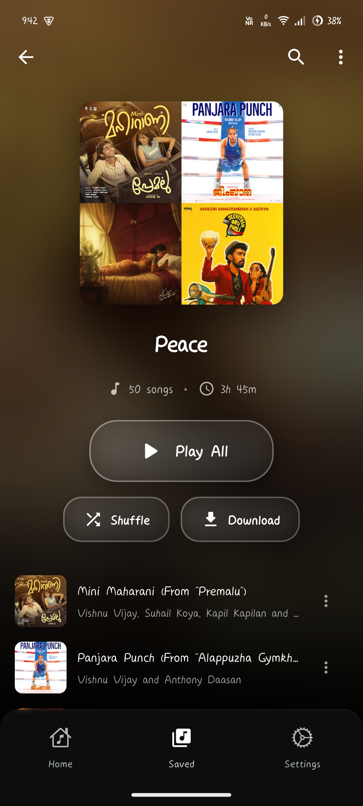

  
  
  # MuzicX App
  
  
  ### Your Ultimate Music Streaming & Download Companion
  
  
  
  
  
  
  **Stream • Download • Enjoy**
  
  [Download Now](#installation) • [Features](#features) • [Screenshots](#screenshots) • [Support](#support)
  

---

## 📱 App Preview

  
  
<i>Beautiful, intuitive interface designed for music lovers</i>

---

## ✨ Features

### 🎼 Music Streaming & Discovery
- **YouTube Music Integration** - Access millions of songs from YouTube Music
- **Smart Search** - Find your favorite songs, albums, artists instantly
- **Personalized Home** - Dynamic recommendations and trending music
- **Browse by Genre** - Explore music across multiple categories
- **Artist & Album Pages** - Deep dive into your favorite artists' discographies

### 💾 Downloads & Offline Playback
- **Downloads** - Download songs (M4A)
- **Active Download Manager** - Track and manage multiple downloads simultaneously
- **Playlist Downloads** - Download entire playlists with one tap
- **Resume & Pause** - Full control over download operations
- **Offline Mode** - Enjoy your music without internet connection
- **Smart Storage Management** - View and manage downloaded files efficiently

### 📚 Library Management
- **Favorites System** - Save your loved tracks with cloud sync
- **Custom Playlists** - Create and organize unlimited playlists
- **YouTube Music Import** - Import your YT Music playlists seamlessly
- **Spotify Import** - Bring your Spotify playlists to MuzicX
- **Listen History** - Track your listening habits across devices
- **Smart Organization** - Auto-categorized library with search

### 🎵 Advanced Audio Player
- **High-Fidelity Playback** - Crystal clear audio quality
- **Queue Management** - Reorder, shuffle, and organize your queue
- **Lyrics Support** - Synchronized lyrics display
- **Sleep Timer** - Auto-stop playback after set duration
- **Audio Equalizer** - Customize your sound experience
- **Background Playback** - Continue listening while using other apps
- **Mini Player** - Persistent playback controls across app

### 🎨 Customization & Preferences
- **Dynamic Theming** - Automatic color adaptation based on album art
- **Dark/Light Mode** - Choose your preferred theme
- **Multiple Languages** - Localized interface support
- **Custom Settings** - Personalize your experience
- **Appearance Controls** - Fine-tune the visual experience

### 🔔 Smart Features
- **Download Notifications** - Real-time progress updates
- **Force Update System** - Stay up-to-date with latest features
- **Share Songs** - Share your favorite tracks with friends
- **Intent Sharing** - Open shared music links directly in MuzicX
- **Offline Detection** - Smart handling of network changes

### 🖥️ Platform Support
- ✅ **Android** - Optimized for Android devices
---

## 📸 Screenshots

  <table>
    <tr>
      <td></td>
      <td></td>
      <td></td>
    </tr>
    <tr>
      <td align="center"><b>Home</b></td>
      <td align="center"><b>Player</b></td>
      <td align="center"><b>Library</b></td>
    </tr>
  </table>

---

## 🌐 Website

Visit our official website: **[www.muzicx.app]([https://www.muzicx.app](https://muzic-x.vercel.app/))** 

### Web Features
- 📱 Download link for the apk 
- 📚 Complete documentation
- 🎓 User guides and tutorials
- 💬 Community forum
- 📧 Support center
- 🆕 Latest updates and changelogs

---

## 📄 License

This project is licensed under the MIT License - see the [LICENSE](LICENSE) file for details.

---

## 💖 Support

If you like MuzicX, please consider:

- ⭐ Starring this repository
- 🐛 Reporting bugs and issues
- 💡 Suggesting new features
- 📢 Sharing with your friends

### Contact & Support
- 💬 Discord: [Join our community](https://discord.gg/muzicx)

---

## ⚠️ Disclaimer

MuzicX is a third-party application and is not affiliated with or endorsed by YouTube, Google, or Spotify. This app is intended for personal use only. Please respect copyright laws and artist rights.

---

  
  **Made by the MuzicX Team**
  
  © 2025 MuzicX. All rights reserved.
  
  [Website](https://muzic-x.vercel.app/) • 
  

#

