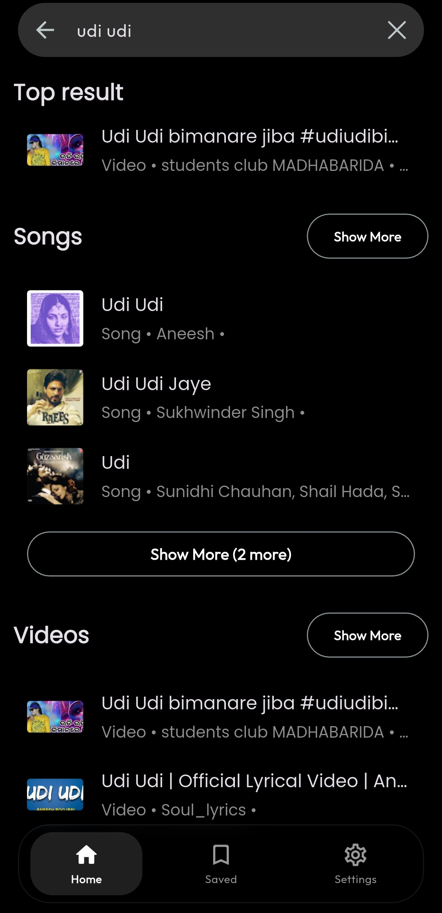
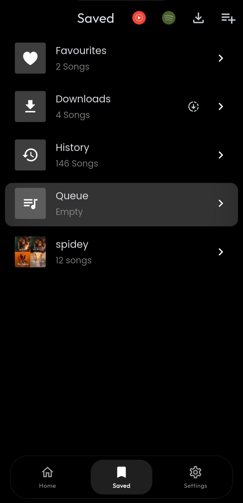
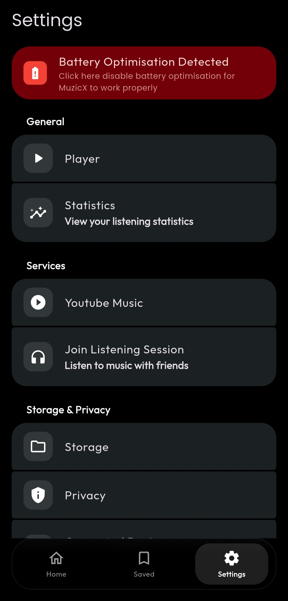

<div align="center">


# 🎵 MuzicX

### Your Ultimate Music Streaming & Download Companion


<br>


<br>

⭐ Stream • Download • Organize • Enjoy ⭐

<br>

<a href="https://muzic-x.vercel.app/">

</a>

</div>

---

# 🎬 App Preview

<div align="center">

> Replace this image with a GIF recording later


</div>

---

# ✨ Features

## 🎼 Music Streaming

* YouTube Music Integration
* Smart Search
* Trending Songs
* Artist Pages
* Album Exploration
* Genre Browsing

## 💾 Downloads

* Song Downloads
* Playlist Downloads
* Resume Downloads
* Download Queue
* Offline Playback
* Storage Management

## 📚 Library

* Favorites Sync
* Unlimited Playlists
* Spotify Import
* YouTube Music Import
* Listening History
* Search Library

## 🎵 Audio Player

* Background Playback
* Lyrics Support
* Sleep Timer
* Queue Management
* Equalizer
* Mini Player

## 🎨 Customization

* Dynamic Colors
* Dark Mode
* Light Mode
* Multiple Languages
* Appearance Settings

---

# 📱 Screenshots

<div align="center">

<table>

<tr>

<td align="center">

<br>
<b>🏠 Home</b>
</td>

<td align="center">

<br>
<b>🔍 Search</b>
</td>

<td align="center">

<br>
<b>🎵 Player</b>
</td>

</tr>

<tr>

<td align="center">

<br>
<b>❤️ Library</b>
</td>

<td align="center">

<br>
<b>⚙️ Settings</b>
</td>

</tr>

</table>

</div>

---

# 🚀 Why MuzicX?

| Feature            | MuzicX |
| ------------------ | ------ |
| Offline Playback   | ✅      |
| Playlist Downloads | ✅      |
| Spotify Import     | ✅      |
| Lyrics Support     | ✅      |
| Dynamic Themes     | ✅      |
| Sleep Timer        | ✅      |
| Equalizer          | ✅      |
| Background Audio   | ✅      |

---

# 🛠 Tech Stack

| Technology          | Usage            |
| ------------------- | ---------------- |
| Flutter             | Frontend         |
| Firebase            | Backend          |
| Hive                | Local Database   |
| YouTube Music API   | Music Source     |
| Spotify API         | Playlist Import  |
| Just Audio          | Audio Playback   |
| Provider / Riverpod | State Management |

---

# 📥 Installation

## Download APK

Visit:

https://muzic-x.vercel.app/

## Build From Source

```bash
git clone https://github.com/MrTG-CodeBot/muzicX-music-app.git

cd muzicX-music-app

flutter pub get

flutter run
```

---

# 📊 Project Status

* ✅ Music Streaming
* ✅ Downloads
* ✅ Offline Playback
* ✅ Spotify Import
* ✅ YouTube Import
* ✅ Dynamic Themes
* ✅ Equalizer
* 🚧 Windows Support
* 🚧 Linux Support
* 🚧 AI Recommendations

---

# 🗺 Roadmap

* [x] Music Streaming
* [x] Downloads
* [x] Playlist Support
* [x] Spotify Import
* [x] Lyrics Support
* [ ] Desktop Version
* [ ] Smart Recommendations
* [ ] AI Playlist Generator
* [ ] Chromecast Support
* [ ] Collaborative Playlists

---

# 🌐 Website

Official Website:

https://muzic-x.vercel.app/

Features:

* APK Downloads
* Documentation
* Changelog
* User Guides
* Support Center
* Latest Updates

---

# ⚠ Disclaimer

MuzicX is a third-party application and is not affiliated with or endorsed by YouTube, Google, Spotify, or any associated companies.

Please respect copyright laws and artist rights when using this application.

---

# 💖 Support

If you enjoy MuzicX:

⭐ Star the repository

🐛 Report bugs

💡 Suggest features

📢 Share with friends

---

<div align="center">

## 🎵 Made with ❤️ by MuzicX Team

### Stream. Download. Enjoy.

© 2026 MuzicX

</div>
